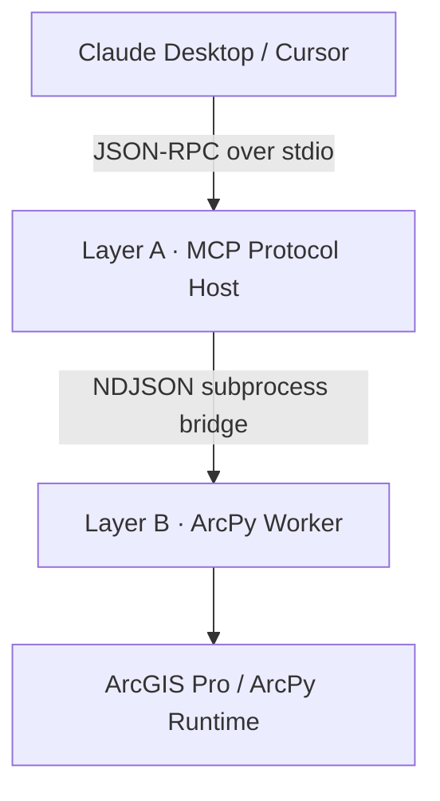

[](https://glama.ai/mcp/servers/muend/arcgis-mcp-bridge)
[](https://smithery.ai/servers/muend/arcgis-mcp-bridge)

# arcgis-mcp-bridge

## 📦 Installation

You can install the official release of `arcgis-mcp-bridge` directly from [PyPI (Python Package Index)](https://pypi.org/project/arcgis-mcp-bridge/):

```bash
# Traditional installation
pip install arcgis-mcp-bridge
# Modern, lightning-fast alternative
uv pip install arcgis-mcp-bridge
```

**100 declarative geoprocessing tools. Two isolated processes. One security floor.**

A secure, local-first, asynchronous MCP server exposing ArcGIS Pro's ArcPy
engine to Claude Desktop and other MCP hosts over stdio JSON-RPC.

Technical write-up: https://dev.to/muend/building-a-secure-mcp-bridge-for-arcgis-pro-and-arcpy-511g

| | |
|---|---|
| Catalog | 100 tools · 10 verticals |
| Tests | 85 unit tests · 85/85 passing · arcpy mocked |
| Real runtime evidence | [Reproducible ArcGIS Pro MCP smoke benchmark](benchmarks/) |
| Static analysis | Ruff clean · Mypy `strict` clean |
| Transport | JSON-RPC 2.0 over stdio |
| License | Apache-2.0 |

---

## Why arcgis-mcp-bridge?

| Feature | arcgis-mcp-bridge | geo2004/MCP-ArcGISPro | nicogis (C#/.NET) |
|---|---|---|---|
| Tools | **100** | ~15 | ~10 |
| **Dependency Sync** | **Deterministic (`uv.lock`)** | Imperative (`requirements.txt`) | Native Nuget |
| Transport | stdio JSON-RPC | file-based IPC | Named Pipes |
| Security Architecture | Documented PathGuard sandbox | None specified / default host access | None specified / default host access |
| arcpy Isolation | **Two-process architecture** | Single process execution | Add-In in-process execution |
| CI (Offline Verification) | ✅ Supported | ❌ Not available | ❌ Not available |
| License | Apache-2.0 | MIT | MIT |

---

## Highlight: Sketch → GIS Pipeline

Hand-drawn parcel boundary → photo → geodatabase feature class.
ORB+RANSAC image registration, HSV ink segmentation, direct GDB commit.
No manual digitizing required.

> **Demo coming soon.** To preview the sketch-to-GIS pipeline:
> 1. Draw a polygon on paper and photograph it.
> 2. Ask Claude: *"Use extract_sketch_to_gis to register this photo
>    against my basemap and commit the result to my GDB."*
> 3. The feature class appears in ArcGIS Pro — no manual digitizing.

---

## 00 — Example Prompts

After `health_check` succeeds, talk to Claude naturally:

```
"Buffer all parcels in my GDB by 50 meters and save to scratch."
"List all feature classes in C:\GIS\city.gdb starting with 'road_'."
"Dissolve the neighborhoods layer by district_id."
"Run kernel density on crime_points with a 500-meter search radius."
"Calculate slope and aspect from the DEM at C:\GIS\dem.tif."
"Find the 3 nearest facilities to each incident in my network dataset."
"Check geometry on all feature classes in my GDB and repair errors."
```

## 01 — Core Architecture & Philosophy



**Layer A — Async Event-Driven Server** (`arcgis_mcp/server.py`).
FastMCP on the bridge interpreter. Owns the stdio channel, validates every
request against frozen Pydantic v2 contracts, dispatches work via
`asyncio.create_subprocess_exec` — the event loop never blocks on a
geoprocessing call and never holds a thread lock. Layer A contains **zero
module-level `arcpy` or `cv2` imports** (verified by grep in the audit
gate); it cannot crash on Esri's native code because it never touches it.

**Layer B — Subprocess ArcPy Isolation Worker** (`arcgis_mcp/worker.py`).
Spawned per job on the licensed ArcGIS Pro interpreter
(`ARCPY_PYTHON_PATH`). The only place `import arcpy` is legal; `cv2` loads
lazily inside the one vision tool that needs it. Worker stdout is rebound
to stderr at startup — the single sanctioned stdout write is the final
NDJSON result frame, so native ArcObjects chatter can never corrupt the
JSON-RPC channel. A native crash terminates the worker, not the server:
the parent converts a non-zero exit into a structured error frame.
 
**Declarative registry** (`arcgis_mcp/registry.py`).
Each tool is one `ToolSpec(name, category, description, input_model,
worker_fn, destructive)`. One generic proxy factory materializes all 100
MCP endpoints in Layer A; one generic `run_tool` dispatcher serves them in
Layer B. Adding tool #101 touches two files — never the runtime loops.

Every failure crossing the process boundary is classified:
`validation` · `security` · `license` · `geoprocessing` (with the full
`arcpy.GetMessages()` stack) · `internal`.

---

## 02 — The 100-Tool Census Matrix

| # | Vertical | Tools | Key capabilities |
|---|---|---:|---|
| 1 | `map_layer_management` | 10 | .aprx maps, layer order/visibility/symbology, camera, save |
| 2 | `data_management` | 22 | FC/GDB lifecycle, fields, Describe, Excel/GeoJSON/CSV exchange |
| 3 | `geometry_analysis` | 23 | Overlays, dissolve/merge, selections, joins, proximity, fishnet |
| 4 | `coordinate_reference_projection` | 4 | WKID-driven define/project for vector + raster, CRS lookup |
| 5 | `raster_operations` | 15 | Map algebra, zonal stats, DEM slope/aspect/hillshade, hydrology |
| 6 | `vision_analytics` | 1 | Sketch-to-GIS: ORB+RANSAC registration → HSV ink → GDB commit |
| 7 | `export_layout` | 9 | PDF/PNG plots, DPI control, map frames, text/legend, page size |
| 8 | `editing_topology` | 7 | Repair/check geometry, append, dedupe, diff, topology validation |
| 9 | `network_analysis` | 4 | Service areas, routing, OD cost matrix, closest facility |
| 10 | `spatial_statistics` | 5 | Mean center, ellipse, kernel density, Gi* hot spots, Moran's I |
| | **Total** | **100** | |

Esri extension licenses (`Spatial`, `Network`) are checked out through one
shared context manager and checked back in inside `finally` — a crash can
never leave a seat locked. Unavailable licenses return a structured frame,
not a process drop.

### Destructive Mutation Safety Floor

Ten state-mutating tools refuse to run without an explicit
`confirm: true` payload token. The gate fires in the dispatcher **before**
the 10–30 s `arcpy` import is paid, and the registry refuses to even
register a destructive spec whose contract lacks a `confirm` field:

```text
append_features        calculate_field        define_projection
delete_dataset         delete_field           delete_identical
extract_sketch_to_gis  near_analysis          remove_layer_from_map
repair_geometry
```

`calculate_field` carries an additional expression-channel floor: the
default `expression_type` is **ARCADE** (Esri's sandboxed expression
language), and `PYTHON3` — which executes code inside the worker — is
rejected at the Layer-A contract boundary unless `confirm: true` is
explicitly supplied. `raster_calculator` expressions are constrained to a
pure map-algebra grammar (identifiers, numbers, operators; no quotes, no
dunder access) by a contract validator.

---

## 03 — Automated Quality Gate & Testing

Licensed-runtime evidence is reported separately in the
[`benchmarks/`](benchmarks/) method card. Its committed result uses a real
ArcGIS Pro worker and a dedicated scratch GDB; it is not pooled with the mocked
unit-test count or presented as validation of all 100 geoprocessing tools.

**Scope, stated plainly:** the automated gate currently consists of
**85 unit tests** spanning the PathGuard boundary, the Pydantic contracts,
the generic registry path-guard and registration invariants, the worker's
error-boundary mapping, and `Settings` environment validation. It exercises
the catalog's structural contracts and every security-critical seam — it does
not claim multi-scenario validation of the 100 geoprocessing tools themselves,
which execute against a licensed ArcGIS runtime that no CI runner has.

**In-memory test architecture.** `tests/conftest.py` injects `MagicMock`
proxies into `sys.modules["arcpy"]` and `sys.modules["arcpy.sa"]` (with
`CheckExtension` answering `"Available"`) before any package import
resolves. The entire suite executes in well under a second, with no ArcGIS
installation, no license checkout, and no Esri runtime — locally and in CI
identically.

**Test scopes.**

- `tests/test_security.py` & `tests/test_pathguard.py` — the PathGuard boundary
  firewall, exercised against real directories via pytest's `tmp_path` fixture:
  valid reads/writes inside the sandbox pass; traversal (`..`-segments), UNC,
  relative, NUL-byte, reserved-device, over-length and out-of-root paths are
  rejected; write discipline (ArcGIS dataset-name rules, overwrite opt-in) is
  enforced. 30 tests.
- `tests/test_contracts.py` — Pydantic contract enforcement: per-tool parameter
  specs, cross-field validators, `frozen` / `extra="forbid"`, and the
  `ok`-xor-`error` invariant on the IPC envelope. 15 tests.
- `tests/test_registry.py` & `tests/test_registry_guard.py` — registry stream
  integrity plus generic `apply_path_guard` enforcement and `register`
  invariants — every schema must be a `ToolInput` subclass, every `path_fields`
  entry must reference a valid role, duplicate names are rejected, and every
  destructive spec must carry its `confirm` gate. 11 tests.
- `tests/test_worker.py` — `process_frame` error-boundary mapping: every failure
  class (validation, security, license, geoprocessing, internal) maps to its
  distinct `WorkerError.kind`. 10 tests.
- `tests/test_config.py` — `Settings.from_environment` validation: required
  variables, directory/file checks, integer bounds, and the fail-fast on a
  missing scratch geodatabase. 15 tests.

The side-effect import `import arcgis_mcp.tools` in the registry test is
what populates the catalog; it is `# noqa`-pinned so no linter ever strips
it again.

**Static analysis.** Ruff enforces canonical formatting plus
`E/W/F/I/B/RUF` at 88 columns against a `py311` floor (code must parse on
the oldest supported interpreter — Layer B). Turkish comments are
first-class: the dotless `ı`/`İ` are registered under
`allowed-confusables`, so prose is configured around, never rewritten.
Mypy runs `strict = true` with the Pydantic plugin across all 31 source
files.

```bash
make format          # ruff format + import sorting (mutates)
make lint            # ruff check, mutates nothing
make type-check      # mypy --strict over arcgis_mcp/
make security-audit  # live registry inspection: path roles + confirm gates
make verify-all      # lint + type-check + security-audit, one gate
python -m pytest     # 85/85
```

---

## 04 — Security Framework (PathGuard Sandbox)

Every filesystem argument in every contract declares its role —
`"read"`, `"write"`, or `"read_list"` — in the model's `path_fields`
mapping. One shared enforcement function applies those declarations in
**both** processes: Layer A pre-checks before a worker is ever spawned;
Layer B re-validates because it never trusts its parent.

Two boundary controls:

- `validate_read(raw: str)` — fully resolves the path (symlinks, `..`,
  relative segments collapsed *before* any comparison) and requires
  containment inside a configured `allowed_roots` directory. Existence is
  enforced via a **deepest-existing-prefix** resolution strategy: the
  targeted path or its filesystem-resolvable geodatabase prefix must
  exist. This is what makes GDB-internal datasets
  (`…\city.gdb\roads`) first-class — the `.gdb` container is validated on
  the filesystem, while the logical tail is constrained to plain dataset
  names only arcpy can resolve.
- `validate_write(raw: str, *, overwrite: bool)` — same resolution and
  containment, plus ArcGIS-legal dataset naming and the overwrite
  discipline: an existing target is never replaced unless the request
  explicitly sets `overwrite: true`.

Any escape pattern — traversal sequences, UNC shares, NUL bytes, reserved
device names, out-of-root targets — raises `PathSecurityError`
immediately: the request is answered with a structured `security` frame
and no subprocess is ever orchestrated for it.

---

## 05 — 📦 Installation

Choose the onboarding pipeline that fits your operational objective:

### Path A: Pure PyPI Installation (Recommended for Quick Deployments)

Ideal if you want to use the server out-of-the-box via Claude Desktop
without cloning source files.

```bash
pip install arcgis-mcp-bridge
# Execute the unified setup console command to clone your environment
arcgis-mcp-setup
```

### Path B: Git Clone & Deterministic Development (Recommended for GIS Contributors)

This project leverages **Astral `uv`** for light-speed, deterministic python environment management and synchronization.

```bash
# 1. Clone the repository
git clone https://github.com/muend/arcgis-mcp-bridge.git
cd arcgis-mcp-bridge

# 2. Create an ISOLATED dev venv pinned to the ArcGIS Pro 3.11 interpreter.
#    Do NOT pass --system-site-packages: Layer A never imports arcpy (the
#    worker runs in a SEPARATE interpreter resolved via ARCPY_PYTHON_PATH), so
#    inheriting ArcGIS's full site-packages only leaks interpreter-incompatible
#    third-party packages into the pytest/mypy gates. Keep this venv hermetic.
uv venv --python "C:\Program Files\ArcGIS\Pro\bin\Python\envs\arcgispro-py3\python.exe"

# 3. Activate the virtual environment
.venv\Scripts\activate

# 4. Sync all frozen dependencies deterministically using uv
#    --locked fails fast if uv.lock has drifted from pyproject.toml,
#    guaranteeing the install matches the committed resolution exactly.
uv sync --locked
```

> **Note:** To enable the hand-drawn sketch-to-GIS pipeline, install using the `[vision]` or `[dev,vision]` flag to pull the downstream dependencies `opencv-python-headless` and `numpy` into your environment:
> `uv sync --locked --extra vision` or `uv sync --locked --all-extras`

Both paths share the same setup engine (`arcgis-mcp-setup` ≡
`python -m arcgis_mcp.setup_env`): idempotent, accepts `--env-name`
(default `arcgis-mcp-env`) and `--dry-run`; set `ARCGIS_CONDA_EXE` if conda
is not on `PATH`. It emits a JSON report whose `python_exe` value becomes
`ARCPY_PYTHON_PATH`.

**Worker integrity — `ARCPY_PYTHON_PATH` must resolve the package stack.**
Layer B is launched as `-m arcgis_mcp.worker`, so its interpreter must
resolve the worker's runtime requirements — Pydantic above all (the IPC
contracts are re-validated inside Layer B). The pristine `arcgispro-py3`
environment does not ship Pydantic and is read-only, so it cannot acquire
it. **Recommended configuration: point both the server `command` and
`ARCPY_PYTHON_PATH` at the same cloned `arcgis-mcp-env`** — one
environment, one dependency set, no context drift, no missing-package
failures at job time.

Install the full stack into that environment
(`pip install "pydantic>=2.5" mcp` and, for the vision pipeline,
`pip install opencv-python-headless numpy`).

| Variable | Required | Purpose |
|---|---|---|
| `ARCPY_PYTHON_PATH` | yes | Layer B interpreter: licensed arcpy **and** Pydantic resolvable (use `arcgis-mcp-env`) |
| `ARCGIS_MCP_ALLOWED_ROOTS` | no | `;`-separated PathGuard boundary roots; defaults to `~/Documents/ArcGIS/Projects` if unset |
| `ARCGIS_MCP_SCRATCH_GDB` | no | Default output workspace; must already exist (startup fails fast if missing) |
| `ARCGIS_MCP_LOG_FILE` / `_LOG_LEVEL` / `_TOOL_TIMEOUT` | no | Logging + per-job ceiling |
| `ARCGIS_MCP_MAX_WORKERS` | no | Concurrent arcpy worker ceiling (default 2) — protects license seats and RAM |

### Claude Desktop Configuration

Pick the block that matches how you installed the server.
(`ARCPY_PYTHON_PATH` is **required** in both variants — it is the licensed
worker interpreter reported by the setup command's JSON output.)

##### Option 1: Global/PyPI Installation Config

```json
{
  "mcpServers": {
    "arcgis-mcp-bridge": {
      "command": "arcgis-mcp-server",
      "env": {
        "ARCPY_PYTHON_PATH": "C:\\...\\envs\\arcgis-mcp-env\\python.exe",
        "ARCGIS_MCP_ALLOWED_ROOTS": "C:\\GIS\\Data;C:\\Workspace",
        "ARCGIS_MCP_MAX_WORKERS": "2"
      }
    }
  }
}
```

##### Option 2: Local Git Clone Config

```json
{
  "mcpServers": {
    "arcgis-mcp-bridge": {
      "command": "C:\\...\\envs\\arcgis-mcp-env\\Scripts\\python.exe",
      "args": [
        "-m",
        "arcgis_mcp.server"
      ],
      "env": {
        "PYTHONPATH": "C:\\path\\to\\arcgis-mcp-bridge",
        "ARCPY_PYTHON_PATH": "C:\\...\\envs\\arcgis-mcp-env\\python.exe",
        "ARCGIS_MCP_ALLOWED_ROOTS": "C:\\GIS\\Data;C:\\Workspace",
        "ARCGIS_MCP_MAX_WORKERS": "2"
      }
    }
  }
}
```

After restart, call `health_check` first — it proves the full
server→worker pipeline without importing arcpy.

---

## 06 — Compatibility

| ArcGIS Pro | Python (arcgispro-py3) | Status |
|---|---|---|
| 3.1 | 3.9 | ✅ Tested |
| 3.2 | 3.9 | ✅ Tested |
| 3.3 | 3.11 | ✅ Tested — reference platform |
| 3.4 | 3.11 | ⚠ Community-reported, not CI-verified |

**Windows only.** ArcPy is Windows-exclusive. Layer A runs on any
platform for development (MagicMock injection), but Layer B requires
a licensed ArcGIS Pro installation on Windows.

---

## 07 — License

Apache License 2.0. See [LICENSE](LICENSE).

<!-- mcp-name: io.github.muend/arcgis-mcp-bridge -->
