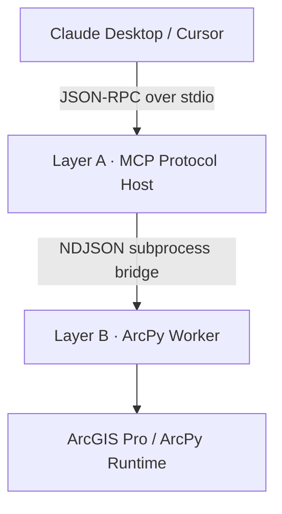

[](https://glama.ai/mcp/servers/muend/arcgis-mcp-bridge)
[](https://smithery.ai/servers/muend/arcgis-mcp-bridge)

# arcgis-mcp-bridge

## Quick Start

`arcgis-mcp-bridge` requires Windows, a licensed ArcGIS Pro installation, and
Python 3.11 or newer for the bridge package.

Install the bootstrap package using **one** package manager:

```powershell
# Option A — pip
py -m pip install --upgrade arcgis-mcp-bridge

# Option B — uv
uv pip install --upgrade arcgis-mcp-bridge
```

Then clone ArcGIS Pro's Python environment:

```powershell
# The final JSON report contains the target `python_exe` path.
py -m arcgis_mcp.setup_env
```

If the installed console command is available on `PATH`,
`arcgis-mcp-setup` is equivalent to `py -m arcgis_mcp.setup_env`.

> **Important for Windows systems with multiple Python installations:** the
> setup is not complete until `arcgis-mcp-bridge` is installed into the
> reported `arcgis-mcp-env\python.exe`. Use that same interpreter for both the
> MCP server `command` and `ARCPY_PYTHON_PATH`. This prevents worker failures
> caused by packages or native extensions being loaded from another Python
> environment.

See **05 — Installation** for the complete setup and configuration.

**100 declarative geoprocessing tools. Two isolated processes. One security floor.**

A secure, local-first, asynchronous MCP server exposing ArcGIS Pro's ArcPy
engine to Claude Desktop and other MCP hosts over stdio JSON-RPC.

Technical write-up: [Building a Secure MCP Bridge for ArcGIS Pro and ArcPy](https://dev.to/muend/building-a-secure-mcp-bridge-for-arcgis-pro-and-arcpy-511g)

| | |
|---|---|
| Catalog | 100 tools · 10 verticals |
| Tests | 86 unit tests · 86/86 passing · arcpy mocked |
| Real runtime evidence | [Reproducible ArcGIS Pro MCP smoke benchmark](benchmarks/) |
| Static analysis | Ruff clean · Mypy `strict` clean |
| Transport | JSON-RPC 2.0 over stdio |
| License | Apache-2.0 |

---

## Why arcgis-mcp-bridge?

| Feature | arcgis-mcp-bridge | geo2004/MCP-ArcGISPro | nicogis (C#/.NET) |
|---|---|---|---|
| Tools | **100** | ~15 | ~10 |
| **Dependency Sync** | **Deterministic (`uv.lock`)** | Imperative (`requirements.txt`) | Native NuGet |
| Transport | stdio JSON-RPC | file-based IPC | Named Pipes |
| Security Architecture | Documented PathGuard sandbox | None specified / default host access | None specified / default host access |
| arcpy Isolation | **Two-process architecture** | Single process execution | Add-In in-process execution |
| CI (Offline Verification) | ✅ Supported | ❌ Not available | ❌ Not available |
| License | Apache-2.0 | MIT | MIT |

---

## Highlight: Sketch → GIS Pipeline

Hand-drawn parcel boundary → photo → geodatabase feature class.
ORB+RANSAC image registration, HSV ink segmentation, direct GDB commit.
No manual digitizing required.

> **Demo coming soon.** To preview the sketch-to-GIS pipeline:
> 1. Draw a polygon on paper and photograph it.
> 2. Ask Claude: *"Use extract_sketch_to_gis to register this photo
>    against my basemap and commit the result to my GDB."*
> 3. The feature class appears in ArcGIS Pro — no manual digitizing.

---

## 00 — Example Prompts

After `health_check` succeeds, talk to Claude naturally:

```
"Buffer all parcels in my GDB by 50 meters and save to scratch."
"List all feature classes in C:\GIS\city.gdb starting with 'road_'."
"Dissolve the neighborhoods layer by district_id."
"Run kernel density on crime_points with a 500-meter search radius."
"Calculate slope and aspect from the DEM at C:\GIS\dem.tif."
"Find the 3 nearest facilities to each incident in my network dataset."
"Check geometry on all feature classes in my GDB and repair errors."
```

## 01 — Core Architecture & Philosophy



**Layer A — Async Event-Driven Server** (`arcgis_mcp/server.py`).
FastMCP on the bridge interpreter. Owns the stdio channel, validates every
request against frozen Pydantic v2 contracts, dispatches work via
`asyncio.create_subprocess_exec` — the event loop never blocks on a
geoprocessing call and never holds a thread lock. Layer A contains **zero
module-level `arcpy` or `cv2` imports** (verified by grep in the audit
gate); it cannot crash on Esri's native code because it never touches it.

**Layer B — Subprocess ArcPy Isolation Worker** (`arcgis_mcp/worker.py`).
Spawned per job on the licensed ArcGIS Pro interpreter
(`ARCPY_PYTHON_PATH`). The only place `import arcpy` is legal; `cv2` loads
lazily inside the one vision tool that needs it. Worker stdout is rebound
to stderr at startup — the single sanctioned stdout write is the final
NDJSON result frame, so native ArcObjects chatter can never corrupt the
JSON-RPC channel. A native crash terminates the worker, not the server:
the parent converts a non-zero exit into a structured error frame.
 
**Declarative registry** (`arcgis_mcp/registry.py`).
Each tool is one `ToolSpec(name, category, description, input_model,
worker_fn, destructive)`. One generic proxy factory materializes all 100
catalog MCP endpoints in Layer A; one generic `run_tool` dispatcher serves
them in Layer B. The catalog is exposed alongside three core endpoints:
`health_check`, `list_layers`, and `execute_spatial_tool`. Adding catalog
tool #101 touches two files — never the runtime loops.

Every failure crossing the process boundary is classified:
`validation` · `security` · `license` · `geoprocessing` (with the full
`arcpy.GetMessages()` stack) · `internal`.

---

## 02 — The 100-Tool Census Matrix

| # | Vertical | Tools | Key capabilities |
|---|---|---:|---|
| 1 | `map_layer_management` | 10 | .aprx maps, layer order/visibility/symbology, camera, save |
| 2 | `data_management` | 22 | FC/GDB lifecycle, fields, Describe, Excel/GeoJSON/CSV exchange |
| 3 | `geometry_analysis` | 23 | Overlays, dissolve/merge, selections, joins, proximity, fishnet |
| 4 | `coordinate_reference_projection` | 4 | WKID-driven define/project for vector + raster, CRS lookup |
| 5 | `raster_operations` | 15 | Map algebra, zonal stats, DEM slope/aspect/hillshade, hydrology |
| 6 | `vision_analytics` | 1 | Sketch-to-GIS: ORB+RANSAC registration → HSV ink → GDB commit |
| 7 | `export_layout` | 9 | PDF/PNG plots, DPI control, map frames, text/legend, page size |
| 8 | `editing_topology` | 7 | Repair/check geometry, append, dedupe, diff, topology validation |
| 9 | `network_analysis` | 4 | Service areas, routing, OD cost matrix, closest facility |
| 10 | `spatial_statistics` | 5 | Mean center, ellipse, kernel density, Gi* hot spots, Moran's I |
| | **Total** | **100** | |

Esri extension licenses (`Spatial`, `Network`) are managed through one shared
context manager and checked back in via `finally` on normal Python exception
paths. Worker-process isolation contains native failures to the current job,
while unavailable licenses return a structured error frame instead of
terminating the MCP server.

### Destructive Mutation Safety Floor

Ten state-mutating tools refuse to run without an explicit
`confirm: true` payload token. The gate fires in the dispatcher **before**
the 10–30 s `arcpy` import is paid, and the registry refuses to even
register a destructive spec whose contract lacks a `confirm` field:

```text
append_features        calculate_field        define_projection
delete_dataset         delete_field           delete_identical
extract_sketch_to_gis  near_analysis          remove_layer_from_map
repair_geometry
```

`calculate_field` carries an additional expression-channel floor: the
default `expression_type` is **ARCADE** (Esri's sandboxed expression
language), and `PYTHON3` — which executes code inside the worker — is
rejected at the Layer-A contract boundary unless `confirm: true` is
explicitly supplied. `raster_calculator` expressions are constrained to a
pure map-algebra grammar (identifiers, numbers, operators; no quotes, no
dunder access) by a contract validator.

---

## 03 — Automated Quality Gate & Testing

Licensed-runtime evidence is reported separately in the
[`benchmarks/`](benchmarks/) method card. Its committed result uses a real
ArcGIS Pro worker and a dedicated scratch GDB; it is not pooled with the mocked
unit-test count or presented as validation of all 100 geoprocessing tools.

**Scope, stated plainly:** the automated gate currently consists of
**86 unit tests** spanning the PathGuard boundary, the Pydantic contracts,
the generic registry path-guard and registration invariants, the worker's
error-boundary mapping, and `Settings` environment validation. It exercises
the catalog's structural contracts and every security-critical seam — it does
not claim multi-scenario validation of the 100 geoprocessing tools themselves,
which execute against a licensed ArcGIS runtime that no CI runner has.

**In-memory test architecture.** `tests/conftest.py` injects `MagicMock`
proxies into `sys.modules["arcpy"]` and `sys.modules["arcpy.sa"]` (with
`CheckExtension` answering `"Available"`) before any package import
resolves. The entire suite executes in well under a second, with no ArcGIS
installation, no license checkout, and no Esri runtime — locally and in CI
identically.

**Test scopes.**

- `tests/test_security.py` & `tests/test_pathguard.py` — the PathGuard boundary
  firewall, exercised against real directories via pytest's `tmp_path` fixture:
  valid reads/writes inside the sandbox pass; traversal (`..`-segments), UNC,
  relative, NUL-byte, reserved-device, over-length and out-of-root paths are
  rejected; write discipline (ArcGIS dataset-name rules, overwrite opt-in) is
  enforced.
- `tests/test_contracts.py` — Pydantic contract enforcement: per-tool parameter
  specs, cross-field validators, `frozen` / `extra="forbid"`, and the
  `ok`-xor-`error` invariant on the IPC envelope.
- `tests/test_registry.py` & `tests/test_registry_guard.py` — registry stream
  integrity plus generic `apply_path_guard` enforcement and `register`
  invariants — every schema must be a `ToolInput` subclass, every `path_fields`
  entry must reference a valid role, duplicate names are rejected, and every
  destructive spec must carry its `confirm` gate.
- `tests/test_worker.py` — `process_frame` error-boundary mapping: every failure
  class (validation, security, license, geoprocessing, internal) maps to its
  distinct `WorkerError.kind`.
- `tests/test_config.py` — `Settings.from_environment` validation: required
  variables, directory/file checks, integer bounds, and the fail-fast on a
  missing scratch geodatabase.

The side-effect import `import arcgis_mcp.tools` in the registry test is
what populates the catalog; it is `# noqa`-pinned so no linter ever strips
it again.

**Static analysis.** Ruff enforces canonical formatting plus
`E/W/F/I/B/RUF` at 88 columns against a `py311` floor (code must parse on
the oldest supported interpreter — Layer B). Turkish comments are
first-class: the dotless `ı`/`İ` are registered under
`allowed-confusables`, so prose is configured around, never rewritten.
Mypy runs `strict = true` with the Pydantic plugin across all 31 source
files.

```bash
make format          # ruff format + import sorting (mutates)
make lint            # ruff check, mutates nothing
make type-check      # mypy --strict over arcgis_mcp/
make security-audit  # live registry inspection: path roles + confirm gates
make verify-all      # lint + type-check + security-audit, one gate
python -m pytest     # 86/86
```

---

## 04 — Security Framework (PathGuard Sandbox)

Every filesystem argument in every contract declares its role —
`"read"`, `"write"`, or `"read_list"` — in the model's `path_fields`
mapping. One shared enforcement function applies those declarations in
**both** processes: Layer A pre-checks before a worker is ever spawned;
Layer B re-validates because it never trusts its parent.

Two boundary controls:

- `validate_read(raw: str)` — fully resolves the path (symlinks, `..`,
  relative segments collapsed *before* any comparison) and requires
  containment inside a configured `allowed_roots` directory. Existence is
  enforced via a **deepest-existing-prefix** resolution strategy: the
  targeted path or its filesystem-resolvable geodatabase prefix must
  exist. This is what makes GDB-internal datasets
  (`…\city.gdb\roads`) first-class — the `.gdb` container is validated on
  the filesystem, while the logical tail is constrained to plain dataset
  names only arcpy can resolve.
- `validate_write(raw: str, *, overwrite: bool)` — same resolution and
  containment, plus ArcGIS-legal dataset naming and the overwrite
  discipline: an existing target is never replaced unless the request
  explicitly sets `overwrite: true`.

Any escape pattern — traversal sequences, UNC shares, NUL bytes, reserved
device names, out-of-root targets — raises `PathSecurityError`
immediately: the request is answered with a structured `security` frame
and no subprocess is ever orchestrated for it.

---

## 05 — 📦 Installation

Choose the onboarding path that matches your use case.

### Prerequisites

- Windows with a licensed ArcGIS Pro installation
- Python 3.11 or newer for `arcgis-mcp-bridge`
- An existing writable directory for `ARCGIS_MCP_ALLOWED_ROOTS`
- An existing file geodatabase for `ARCGIS_MCP_SCRATCH_GDB`, unless
  `<first allowed root>\scratch.gdb` already exists

### Path A: Pure PyPI Installation — Recommended for Windows Users

This is the simplest and most reliable setup for Claude Desktop and other MCP
hosts on Windows. The recommended configuration uses the same
`arcgis-mcp-env\python.exe` for both Layer A (the MCP server) and Layer B
(the ArcPy worker).

Choose one bootstrap installation command:

```powershell
# Option A — pip
py -m pip install --upgrade arcgis-mcp-bridge

# Option B — uv
uv pip install --upgrade arcgis-mcp-bridge
```

Then clone ArcGIS Pro's Python environment:

```powershell
# The final JSON report contains the target `python_exe` path.
py -m arcgis_mcp.setup_env
```

If the installed console command is available on `PATH`,
`arcgis-mcp-setup` is equivalent to `py -m arcgis_mcp.setup_env`.

Copy the `python_exe` value from the JSON report and assign it below:

```powershell
$ArcGISMcpPython = "C:\...\envs\arcgis-mcp-env\python.exe"
```

Choose one installation command:

```powershell
# Standard installation
& $ArcGISMcpPython -m pip install --upgrade arcgis-mcp-bridge

# OR: include the optional OpenCV-based sketch-to-GIS extension
& $ArcGISMcpPython -m pip install --upgrade "arcgis-mcp-bridge[vision]"
```

Do not run both commands; the second command already installs the standard
package together with the `vision` extra.

Use `$ArcGISMcpPython` as both the MCP server interpreter and
`ARCPY_PYTHON_PATH`. This prevents `arcgis_mcp`, Pydantic, `pydantic-core`,
and other native dependencies from being resolved from a different Python
installation.

### Path B: Git Clone & Deterministic Development — GIS Contributors

This path keeps Layer A in a hermetic development environment while running
ArcPy work in a separately cloned, licensed `arcgis-mcp-env` worker.

```powershell
# 1. Clone the repository.
git clone https://github.com/muend/arcgis-mcp-bridge.git
cd arcgis-mcp-bridge

# 2. Create the isolated development environment.
#    Do not use --system-site-packages: Layer A must remain independent of arcpy.
uv venv --python "C:\Program Files\ArcGIS\Pro\bin\Python\envs\arcgispro-py3\python.exe"

# 3. Synchronize the committed dependency resolution.
uv sync --locked
```

Choose one worker-provisioning command:

```powershell
# Standard worker
uv run python -m arcgis_mcp.setup_env --install-runtime-deps --project-root .

# OR: worker with the optional OpenCV-based sketch-to-GIS extension
uv run python -m arcgis_mcp.setup_env --with-vision --project-root .
```

`--with-vision` implies runtime-dependency installation, so the two commands
should not be run consecutively.

The setup command is idempotent, accepts `--env-name` (default:
`arcgis-mcp-env`) and `--dry-run`, and emits a JSON report. Set
`ARCGIS_CONDA_EXE` if ArcGIS Pro's `conda.exe` is not available on `PATH`.

### Worker Interpreter Integrity

Layer B is launched as:

```text
ARCPY_PYTHON_PATH -m arcgis_mcp.worker
```

The interpreter referenced by `ARCPY_PYTHON_PATH` must be able to import the
complete worker stack:

```text
arcgis_mcp
pydantic
pydantic_core
arcpy
```

For a first-time Windows installation, use the same
`arcgis-mcp-env\python.exe` for the server `command` and
`ARCPY_PYTHON_PATH`. Separate server and worker environments remain supported
for development, but the worker interpreter must contain its own compatible
installation of `arcgis-mcp-bridge` and all runtime dependencies.

Run this preflight check before configuring the MCP host:

```powershell
$ArcGISMcpPython = "C:\...\envs\arcgis-mcp-env\python.exe"

& $ArcGISMcpPython -c "import sys, arcgis_mcp, pydantic, pydantic_core; print(sys.executable); print('Bridge runtime OK')"
& $ArcGISMcpPython -c "import arcpy; print('ArcPy', arcpy.GetInstallInfo().get('Version'))"
```

### Environment Variables

| Variable | Required | Purpose |
|---|---|---|
| `ARCPY_PYTHON_PATH` | yes | Absolute path to the licensed worker `python.exe`; it must resolve `arcgis_mcp`, Pydantic/`pydantic_core`, and ArcPy |
| `ARCGIS_MCP_ALLOWED_ROOTS` | no | Windows `;`-separated PathGuard boundary roots; defaults to `~/Documents/ArcGIS/Projects` |
| `ARCGIS_MCP_SCRATCH_GDB` | no | Default output workspace; if omitted, defaults to `<first allowed root>\scratch.gdb`; the GDB must already exist |
| `ARCGIS_MCP_LOG_FILE` | no | Optional rotating log-file path |
| `ARCGIS_MCP_LOG_LEVEL` | no | `DEBUG`, `INFO`, `WARNING`, or `ERROR`; default `INFO` |
| `ARCGIS_MCP_TOOL_TIMEOUT` | no | Positive per-job timeout in seconds; default `600` |
| `ARCGIS_MCP_MAX_WORKERS` | no | Concurrent ArcPy worker ceiling; default `2`, protecting license seats and RAM |

### Claude Desktop Configuration

`ARCPY_PYTHON_PATH` is required in every configuration and must point to the
licensed interpreter reported by the setup command.

Replace every placeholder path below with an existing path on your machine.
The scratch geodatabase must already exist.

#### Option 1: Unified PyPI Environment — Recommended on Windows

Use the same interpreter for the MCP server and ArcPy worker:

```json
{
  "mcpServers": {
    "arcgis-mcp-bridge": {
      "command": "C:\\...\\envs\\arcgis-mcp-env\\python.exe",
      "args": [
        "-m",
        "arcgis_mcp.server"
      ],
      "env": {
        "ARCPY_PYTHON_PATH": "C:\\...\\envs\\arcgis-mcp-env\\python.exe",
        "ARCGIS_MCP_ALLOWED_ROOTS": "C:\\GIS\\Data;C:\\Workspace",
        "ARCGIS_MCP_SCRATCH_GDB": "C:\\GIS\\Data\\scratch.gdb",
        "ARCGIS_MCP_MAX_WORKERS": "2"
      }
    }
  }
}
```

The `command` and `ARCPY_PYTHON_PATH` values should be identical in this
configuration. Use the `python_exe` value returned by the setup command.

#### Option 2: Local Git Development Environment

Use the repository `.venv` for Layer A and the provisioned
`arcgis-mcp-env` for Layer B:

```json
{
  "mcpServers": {
    "arcgis-mcp-bridge": {
      "command": "C:\\path\\to\\arcgis-mcp-bridge\\.venv\\Scripts\\python.exe",
      "args": [
        "-m",
        "arcgis_mcp.server"
      ],
      "env": {
        "ARCPY_PYTHON_PATH": "C:\\...\\envs\\arcgis-mcp-env\\python.exe",
        "ARCGIS_MCP_ALLOWED_ROOTS": "C:\\GIS\\Data;C:\\Workspace",
        "ARCGIS_MCP_SCRATCH_GDB": "C:\\GIS\\Data\\scratch.gdb",
        "ARCGIS_MCP_MAX_WORKERS": "2"
      }
    }
  }
}
```

This split-environment configuration assumes that the worker was provisioned
from the repository with one of the Path B setup commands above. `PYTHONPATH`
is not required when `uv sync --locked` has installed the project into the
repository `.venv`.

A globally resolved `arcgis-mcp-server` command can work, but it creates a
split-environment deployment. It is not recommended for first-time Windows
setup unless the worker environment has been provisioned and verified
separately.

After restarting the MCP host, call `health_check` first. It verifies the
server-to-worker IPC path and reports the selected worker interpreter without
importing ArcPy. Then run a read-only ArcGIS tool or the ArcPy preflight command
above to validate the licensed runtime.

---

## 06 — Troubleshooting

### `Worker process exited with code 1`

If the MCP server starts but every ArcGIS tool fails, inspect the server log for
the worker traceback. Common environment-related causes include:

```text
ModuleNotFoundError: No module named 'arcgis_mcp'
ModuleNotFoundError: No module named 'pydantic_core._pydantic_core'
```

These errors usually mean that the worker is using a different Python
installation, the bridge was not installed into the worker interpreter, or the
worker contains an incomplete or incompatible Pydantic installation. The recommended fix is the unified-environment configuration documented above.

For the recommended unified configuration, confirm that both values are
identical:

```json
"command": "C:\\...\\envs\\arcgis-mcp-env\\python.exe"
```

```json
"ARCPY_PYTHON_PATH": "C:\\...\\envs\\arcgis-mcp-env\\python.exe"
```

Install or update the bridge inside that exact interpreter:

```powershell
$ArcGISMcpPython = "C:\...\envs\arcgis-mcp-env\python.exe"
& $ArcGISMcpPython -m pip install --upgrade arcgis-mcp-bridge
```

Verify the selected executable and bridge dependencies:

```powershell
& $ArcGISMcpPython -c "import sys, arcgis_mcp, pydantic, pydantic_core; print(sys.executable); print('Bridge runtime OK')"
```

Then verify ArcPy separately:

```powershell
& $ArcGISMcpPython -c "import arcpy; print('ArcPy', arcpy.GetInstallInfo().get('Version'))"
```

If the bridge verification still fails specifically inside `pydantic_core`,
reinstall Pydantic in the same environment so pip restores the matching
compiled dependency:

```powershell
& $ArcGISMcpPython -m pip install --upgrade --force-reinstall --no-cache-dir "pydantic>=2.5,<3"
```

Restart the MCP host completely after changing its Python environment or
configuration.

### `ARCPY_PYTHON_PATH` points to the wrong executable

A Windows conda environment normally places its interpreter at the environment
root:

```text
C:\...\envs\arcgis-mcp-env\python.exe
```

Do not use another global Python installation or a nonexistent
`arcgis-mcp-env\Scripts\python.exe` path.

### Scratch geodatabase startup error

The default scratch workspace is:

```text
<first allowed root>\scratch.gdb
```

It must already exist. Create it in ArcGIS Pro or set
`ARCGIS_MCP_SCRATCH_GDB` to an existing file geodatabase before restarting the
MCP host.

### `health_check` succeeds but ArcGIS tools still fail

`health_check` intentionally verifies the server-to-worker process boundary
without importing ArcPy. A successful result confirms IPC and interpreter
selection, but it does not prove that ArcPy or an optional Esri extension
license can be loaded.

Run the ArcPy preflight command above and inspect the structured worker error
for `license`, `geoprocessing`, or `internal` details.

---

## 07 — Compatibility

| ArcGIS Pro | Bundled Python | Status |
|---|---|---|
| 3.3 | 3.11 | ✅ Reference platform |
| 3.4 | 3.11 | ⚠ Community-reported; verify with the preflight checks |
| 3.1–3.2 | 3.9 | ❌ Unsupported by the current `Python >=3.11` package requirement |

**Windows only.** ArcPy requires a licensed ArcGIS Pro installation on Windows.
Layer A can run on other platforms for development and mocked CI, but Layer B
requires ArcGIS Pro.

The bridge package itself requires Python 3.11 or newer. ArcGIS Pro releases
whose cloned Python environment is older than 3.11 cannot run the current
worker package.

---

## 08 — License

Apache License 2.0. See [LICENSE](LICENSE).

<!-- mcp-name: io.github.muend/arcgis-mcp-bridge -->
