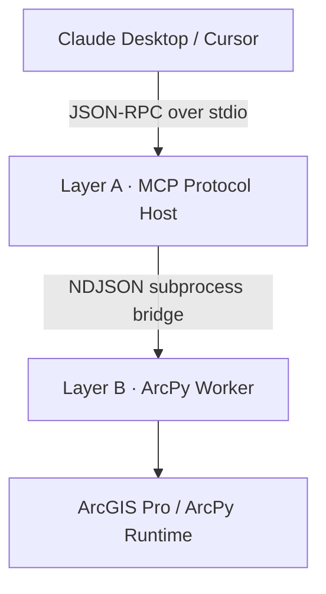

# arcgis-mcp-bridge

**100 declarative geoprocessing tools. Two isolated processes. One security floor.**

A secure, local-first, asynchronous MCP server exposing ArcGIS Pro's ArcPy
engine to Claude Desktop and other MCP hosts over stdio JSON-RPC.

| | |
|---|---|
| Catalog | 100 tools · 10 verticals |
| Tests | 6/6 passing · arcpy fully mocked |
| Static analysis | Ruff clean · Mypy `strict` clean |
| Transport | JSON-RPC 2.0 over stdio |
| License | Apache-2.0 |

---

## 01 — Core Architecture & Philosophy



**Layer A — Async Event-Driven Server** (`arcgis_mcp/server.py`).
FastMCP on the bridge interpreter. Owns the stdio channel, validates every
request against frozen Pydantic v2 contracts, dispatches work via
`asyncio.create_subprocess_exec` — the event loop never blocks on a
geoprocessing call and never holds a thread lock. Layer A contains **zero
module-level `arcpy` or `cv2` imports** (verified by grep in the audit
gate); it cannot crash on Esri's native code because it never touches it.

**Layer B — Subprocess ArcPy Isolation Worker** (`arcgis_mcp/worker.py`).
Spawned per job on the licensed ArcGIS Pro interpreter
(`ARCPY_PYTHON_PATH`). The only place `import arcpy` is legal; `cv2` loads
lazily inside the one vision tool that needs it. Worker stdout is rebound
to stderr at startup — the single sanctioned stdout write is the final
NDJSON result frame, so native ArcObjects chatter can never corrupt the
JSON-RPC channel. A native crash terminates the worker, not the server:
the parent converts a non-zero exit into a structured error frame.

**Declarative registry** (`arcgis_mcp/registry.py`).
Each tool is one `ToolSpec(name, category, description, input_model,
worker_fn, destructive)`. One generic proxy factory materializes all 100
MCP endpoints in Layer A; one generic `run_tool` dispatcher serves them in
Layer B. Adding tool #101 touches two files — never the runtime loops.

Every failure crossing the process boundary is classified:
`validation` · `security` · `license` · `geoprocessing` (with the full
`arcpy.GetMessages()` stack) · `internal`.

---

## 02 — The 100-Tool Census Matrix

| # | Vertical | Tools | Key capabilities |
|---|---|---:|---|
| 1 | `map_layer_management` | 10 | .aprx maps, layer order/visibility/symbology, camera, save |
| 2 | `data_management` | 22 | FC/GDB lifecycle, fields, Describe, Excel/GeoJSON/CSV exchange |
| 3 | `geometry_analysis` | 23 | Overlays, dissolve/merge, selections, joins, proximity, fishnet |
| 4 | `coordinate_reference_projection` | 4 | WKID-driven define/project for vector + raster, CRS lookup |
| 5 | `raster_operations` | 15 | Map algebra, zonal stats, DEM slope/aspect/hillshade, hydrology |
| 6 | `vision_analytics` | 1 | Sketch-to-GIS: ORB+RANSAC registration → HSV ink → GDB commit |
| 7 | `export_layout` | 9 | PDF/PNG plots, DPI control, map frames, text/legend, page size |
| 8 | `editing_topology` | 7 | Repair/check geometry, append, dedupe, diff, topology validation |
| 9 | `network_analysis` | 4 | Service areas, routing, OD cost matrix, closest facility |
| 10 | `spatial_statistics` | 5 | Mean center, ellipse, kernel density, Gi* hot spots, Moran's I |
| | **Total** | **100** | |

Esri extension licenses (`Spatial`, `Network`) are checked out through one
shared context manager and checked back in inside `finally` — a crash can
never leave a seat locked. Unavailable licenses return a structured frame,
not a process drop.

### Destructive Mutation Safety Floor

Nine state-mutating tools refuse to run without an explicit
`confirm: true` payload token. The gate fires in the dispatcher **before**
the 10–30 s `arcpy` import is paid, and the registry refuses to even
register a destructive spec whose contract lacks a `confirm` field:

```text
append_features        define_projection      delete_dataset
delete_field           delete_identical       extract_sketch_to_gis
near_analysis          remove_layer_from_map  repair_geometry
```

---

## 03 — Automated Quality Gate & Testing

**In-memory test architecture.** `tests/conftest.py` injects `MagicMock`
proxies into `sys.modules["arcpy"]` and `sys.modules["arcpy.sa"]` (with
`CheckExtension` answering `"Available"`) before any package import
resolves. The entire suite executes in well under a second, with no ArcGIS
installation, no license checkout, and no Esri runtime — locally and in CI
identically.

**Test scopes.**

- `tests/test_security.py` — the PathGuard boundary firewall, exercised
  against real directories via pytest's `tmp_path` fixture: valid
  reads/writes inside the sandbox pass; directory traversal
  (`..`-segments) and out-of-root absolute paths are rejected. 4 tests.
- `tests/test_registry.py` — registry stream integrity: `all_specs()`
  consumed as a generator, counter-drift detection, and per-spec contract
  validation through the canonical `input_model` attribute — every schema
  must be a `ToolInput` subclass, every `path_fields` entry must reference
  a real model field with a valid role, and every destructive spec must
  carry its `confirm` gate. 2 tests.

The side-effect import `import arcgis_mcp.tools` in the registry test is
what populates the catalog; it is `# noqa`-pinned so no linter ever strips
it again.

**Static analysis.** Ruff enforces canonical formatting plus
`E/W/F/I/B/RUF` at 88 columns against a `py311` floor (code must parse on
the oldest supported interpreter — Layer B). Turkish comments are
first-class: the dotless `ı`/`İ` are registered under
`allowed-confusables`, so prose is configured around, never rewritten.
Mypy runs `strict = true` with the Pydantic plugin across all 31 source
files.

```bash
make format          # ruff format + import sorting (mutates)
make lint            # ruff check, mutates nothing
make type-check      # mypy --strict over arcgis_mcp/
make security-audit  # live registry inspection: path roles + confirm gates
make verify-all      # lint + type-check + security-audit, one gate
python -m pytest     # 6/6
```

---

## 04 — Security Framework (PathGuard Sandbox)

Every filesystem argument in every contract declares its role —
`"read"`, `"write"`, or `"read_list"` — in the model's `path_fields`
mapping. One shared enforcement function applies those declarations in
**both** processes: Layer A pre-checks before a worker is ever spawned;
Layer B re-validates because it never trusts its parent.

Two boundary controls:

- `validate_read(raw: str)` — fully resolves the path (symlinks, `..`,
  relative segments collapsed *before* any comparison), requires
  containment inside a configured `allowed_roots` directory, and requires
  existence.
- `validate_write(raw: str, *, overwrite: bool)` — same resolution and
  containment, plus ArcGIS-legal dataset naming and the overwrite
  discipline: an existing target is never replaced unless the request
  explicitly sets `overwrite: true`.

Any escape pattern — traversal sequences, UNC shares, NUL bytes, reserved
device names, out-of-root targets — raises `PathSecurityError`
immediately: the request is answered with a structured `security` frame
and no subprocess is ever orchestrated for it. GDB-internal references
(`…\city.gdb\roads`) are supported by validating the deepest
filesystem-resolvable prefix and constraining the logical tail to plain
dataset names that cannot smuggle traversal.

---

## 05 — Deployment

```bash
git clone https://github.com/muend/arcgis-mcp-bridge.git
cd arcgis-mcp-bridge
python setup_env.py            # idempotent: clones arcgispro-py3 -> arcgis-mcp-env
```

`setup_env.py` accepts exactly `--env-name` (default `arcgis-mcp-env`) and
`--dry-run`; set `ARCGIS_CONDA_EXE` if conda is not on `PATH`. It emits a
JSON report whose `python_exe` value becomes `ARCPY_PYTHON_PATH`.

Install the server stack into the bridge environment
(`pip install "pydantic>=2.5" mcp`) and, for the vision pipeline, the CV
stack into the worker environment
(`pip install opencv-python-headless numpy`).

| Variable | Required | Purpose |
|---|---|---|
| `ARCPY_PYTHON_PATH` | yes | Layer B licensed interpreter |
| `ARCGIS_MCP_ALLOWED_ROOTS` | yes | `;`-separated PathGuard boundary roots |
| `ARCGIS_MCP_SCRATCH_GDB` | no | Default output workspace |
| `ARCGIS_MCP_LOG_FILE` / `_LOG_LEVEL` / `_TOOL_TIMEOUT` | no | Logging + per-job ceiling |

```json
{
  "mcpServers": {
    "arcgis-pro": {
      "command": "C:\\...\\envs\\arcgis-mcp-env\\python.exe",
      "args": ["-m", "arcgis_mcp.server"],
      "env": {
        "PYTHONPATH": "C:\\path\\to\\arcgis-mcp-bridge",
        "ARCPY_PYTHON_PATH": "C:\\...\\envs\\arcgispro-py3\\python.exe",
        "ARCGIS_MCP_ALLOWED_ROOTS": "C:\\Users\\you\\GIS-Projects"
      }
    }
  }
}
```

After restart, call `health_check` first — it proves the full
server→worker pipeline without importing arcpy.

---

## 06 — License

Apache License 2.0. See [LICENSE](LICENSE).
