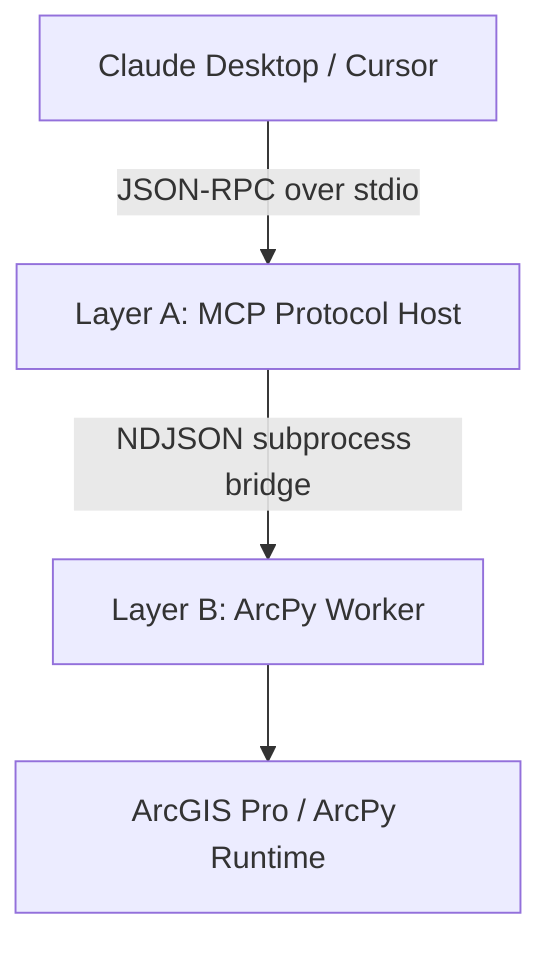

# arcgis-mcp-bridge

A secure, local-first, asynchronous MCP server that exposes ArcGIS Pro's
ArcPy engine to Claude Desktop (and other MCP hosts) over the standard
stdio JSON-RPC transport.

**Current state:** 55 registered tools across Categories 1–3, plus 3 core
diagnostic tools. Categories 4–9 are planned stubs (see roadmap below).

---

## Architecture



The server is split across two processes by design:

- **Layer A (Protocol Host)** — `arcgis_mcp/server.py`, launched by the MCP
  host using the cloned bridge environment's interpreter. It owns the stdio
  JSON-RPC channel, validates every request against Pydantic v2 contracts,
  and never imports `arcpy`.
- **Layer B (ArcPy Worker)** — `arcgis_mcp/worker.py`, spawned per job by
  Layer A using the interpreter set in `ARCPY_PYTHON_PATH` (the licensed
  ArcGIS Pro Python). It is the only module that imports `arcpy`.

Why two interpreters? Esri pins `arcpy` to the Python version shipped with
ArcGIS Pro, and the default `arcgispro-py3` environment is read-only. The
bridge environment (Layer A) carries the MCP/Pydantic dependency stack
without touching Esri's environment; the worker (Layer B) runs on the
licensed interpreter so `arcpy` imports and license checkout work
unmodified. A crash in the native ArcPy layer terminates only the worker
process — the JSON-RPC channel stays alive and returns a structured error.

### Failure handling

Every failure mode crossing the process boundary is classified into a
structured frame: `validation`, `security`, `license`, `geoprocessing`, or
`internal`. Geoprocessing failures return the full `arcpy.GetMessages()`
stack. The server returns structured ArcPy geoprocessing messages after
execution completion (messages are not streamed mid-run).

### Security model

- **PathGuard** — every filesystem argument is fully resolved (symlinks,
  `..`, relative segments) and must land inside a configured allowlist of
  root directories. Enforced twice: in Layer A before a worker is spawned,
  and again inside Layer B, which never trusts the parent.
- **Declarative path roles** — each tool's input model declares its
  filesystem surface (`read`, `write`, `read_list`); one shared guard
  implementation enforces all of it.
- **Overwrite discipline** — outputs are never replaced unless the request
  sets `overwrite: true` explicitly.
- **Destructive-tool gate** — tools that delete or mutate data
  (`delete_dataset`, `delete_field`, `remove_layer_from_map`,
  `near_analysis`) require `confirm: true` and are rejected before the
  expensive `arcpy` import is paid.
- **Closed allowlist** — there is no dynamic `getattr(arcpy, ...)` anywhere;
  every callable tool is an explicit registry entry.

---

## Requirements

- Windows with ArcGIS Pro 3.x installed and licensed
- The `arcgispro-py3` conda environment (ships with Pro; treated as
  strictly read-only)
- A cloned bridge environment (created by `setup_env.py` below) with
  `pydantic >= 2.5` and an MCP server package (`mcp` or `fastmcp`)
  installed into it

---

## Installation

### 1. Clone the repository

```bash
git clone https://github.com/muend/arcgis-mcp-bridge.git
cd arcgis-mcp-bridge
```

### 2. Create the bridge environment

`setup_env.py` is idempotent: it verifies whether the target environment
already exists, clones `arcgispro-py3` only if missing, and probes `arcpy`
out-of-process. Re-running it is always safe.

```bash
python setup_env.py
```

Supported options (these are the only flags the parser accepts):

```bash
python setup_env.py --env-name arcgis-mcp-env   # target env name (default shown)
python setup_env.py --dry-run                   # audit only; never mutates conda state
```

If `conda.exe` is not on `PATH`, point the script at ArcGIS Pro's conda
explicitly before running:

```bat
set ARCGIS_CONDA_EXE=C:\Program Files\ArcGIS\Pro\bin\Python\Scripts\conda.exe
```

The script prints a single JSON report to stdout (all diagnostics go to
stderr). Exit codes: `0` ready, `1` environment or arcpy verification
failure, `2` conda not found. Note the `python_exe` value in the report —
it becomes `ARCPY_PYTHON_PATH` below.

### 3. Install server dependencies into the bridge environment

```bat
activate arcgis-mcp-env
pip install "pydantic>=2.5" mcp
```

---

## Configuration

All configuration is parsed once, at startup, by a single factory
(`Settings.from_environment()`). The server fails fast with an actionable
message if a required variable is missing.

| Variable | Required | Purpose |
|---|---|---|
| `ARCPY_PYTHON_PATH` | yes | Absolute path to the Layer B worker interpreter (`python.exe` reported by `setup_env.py`) |
| `ARCGIS_MCP_ALLOWED_ROOTS` | yes | `;`-separated list of directories the server may read/write (PathGuard boundary) |
| `ARCGIS_MCP_SCRATCH_GDB` | no | Default output workspace; defaults to `<first root>\scratch.gdb` |
| `ARCGIS_MCP_LOG_FILE` | no | Rotating log file path (logging otherwise goes to stderr only) |
| `ARCGIS_MCP_LOG_LEVEL` | no | `DEBUG` / `INFO` / `WARNING` / `ERROR` (default `INFO`) |
| `ARCGIS_MCP_TOOL_TIMEOUT` | no | Per-job wall-clock ceiling in seconds (default `600`) |

### `claude_desktop_config.json`

```json
{
  "mcpServers": {
    "arcgis-pro": {
      "command": "C:\\Program Files\\ArcGIS\\Pro\\bin\\Python\\envs\\arcgis-mcp-env\\python.exe",
      "args": ["-m", "arcgis_mcp.server"],
      "env": {
        "PYTHONPATH": "C:\\path\\to\\arcgis-mcp-bridge",
        "ARCPY_PYTHON_PATH": "C:\\Program Files\\ArcGIS\\Pro\\bin\\Python\\envs\\arcgispro-py3\\python.exe",
        "ARCGIS_MCP_ALLOWED_ROOTS": "C:\\Users\\you\\GIS-Projects"
      }
    }
  }
}
```

Adjust the three paths to your machine: `command` is the Layer A bridge
interpreter, `ARCPY_PYTHON_PATH` is the Layer B licensed interpreter, and
`PYTHONPATH` is the cloned repository root.

After restarting the MCP host, call `health_check` first — it exercises
the full server-to-worker pipeline without importing `arcpy` and reports
both interpreters plus the active configuration.

---

## Tool Catalog

### Core diagnostics (3)

| Tool | Purpose |
|---|---|
| `health_check` | Full pipeline probe (no arcpy import) |
| `list_layers` | Enumerate feature classes, tables, rasters in a GDB |
| `execute_spatial_tool` | Legacy Buffer/Clip gateway from Stage 2 |

### Implemented categories (55 tools)

- [x] **Category 1 — Map / Layer Management (10):** `add_layer_to_map`,
  `remove_layer_from_map`, `list_maps`, `list_layers_in_map`,
  `set_layer_visibility`, `move_layer_order`, `rename_layer`,
  `zoom_to_layer`, `set_layer_symbology`, `save_project`.
  Operates on saved `.aprx` files via `arcpy.mp` — not on a live, open
  ArcGIS Pro session.
- [x] **Category 2 — Data Management (22):** feature class / GDB lifecycle
  (`create_feature_class`, `create_file_gdb`, `delete_dataset`,
  `rename_dataset`, `copy_features`, `compact_gdb`), schema and fields
  (`add_field`, `add_fields_batch`, `delete_field`, `calculate_field`,
  `get_field_info`), inspection (`describe_dataset`, `get_feature_count`,
  `get_extent`), exchange (`export_to_shapefile`, `export_to_geojson`,
  `import_from_geojson`, `table_to_excel`, `excel_to_table`,
  `feature_to_csv`), geometry attributes (`calculate_geometry`,
  `add_xy_coordinates`).
- [x] **Category 3 — Geometry & Analysis (23):** overlays
  (`intersect_features`, `union_features`, `erase_features`,
  `identity_features`, `symmetrical_difference`), aggregation
  (`dissolve_features`, `merge_features`), selection
  (`select_by_attribute`, `select_by_location`), joins and proximity
  (`spatial_join`, `near_analysis`, `generate_near_table`), shape
  derivation (`minimum_bounding_geometry`, `feature_to_point`,
  `feature_vertices_to_points`, `multipart_to_singlepart`,
  `simplify_features`, `smooth_features`, `create_fishnet`), statistics
  (`summarize_within`, `frequency_analysis`, `statistics_analysis`,
  `tabulate_intersection`).

Implementation notes: `select_by_attribute` / `select_by_location`
materialize their selections into real feature classes (transient layer
selections are meaningless in a stateless worker), and `feature_to_csv`
uses Pro 3.x `ExportTable`.

### Roadmap

- [ ] Planned Stubs — Category 4: Coordinate Reference & Projection (4)
- [ ] Planned Stubs — Category 5: Raster Operations (15)
- [ ] Planned Stubs — Category 6: Export & Layout (9)
- [ ] Planned Stubs — Category 7: Editing & Topology (7)
- [ ] Planned Stubs — Category 8: Network Analysis (4)
- [ ] Planned Stubs — Category 9: Spatial Statistics (6)

Each stub module in `arcgis_mcp/tools/` documents the registration
pattern; activating a category means adding its input models and worker
functions — the server and worker dispatch layers require no changes.

---

## Package Layout

```text
arcgis-mcp-bridge/
├── setup_env.py            # idempotent conda audit + clone + arcpy probe
└── arcgis_mcp/
    ├── server.py            # Layer A: composition root, registry-driven endpoints
    ├── worker.py            # Layer B: the only module that imports arcpy
    ├── execution.py         # async subprocess bridge (timeouts, kill/reap)
    ├── registry.py          # declarative ToolSpec registry + shared path guard
    ├── config.py            # Settings.from_environment(), stderr-only logging
    ├── security.py          # PathGuard workspace sanitizer
    ├── contracts/           # Pydantic v2 models, one module per category
    └── tools/               # ToolSpecs + worker functions, one module per category
```

---

## Troubleshooting

- **Server exits immediately on start** — a required environment variable
  is missing; the exact name is printed to stderr (visible in the MCP
  host's logs).
- **`health_check` passes but data tools fail with `[license]`** — the
  worker interpreter cannot check out an ArcGIS license; verify
  `ARCPY_PYTHON_PATH` points at the licensed Pro interpreter and run
  `python setup_env.py --dry-run` to re-audit.
- **`[security]` rejections** — the path is outside
  `ARCGIS_MCP_ALLOWED_ROOTS`, or an output exists and `overwrite` was not
  set, or a destructive tool was called without `confirm: true`. The
  message names the violated rule.
- **First tool call is slow (10–30 s)** — that is the per-job `arcpy`
  import in the spawn-per-call worker. A persistent warm-worker backend is
  a planned optimization behind the same `ExecutionBackend` protocol.

## License

Not yet specified.
